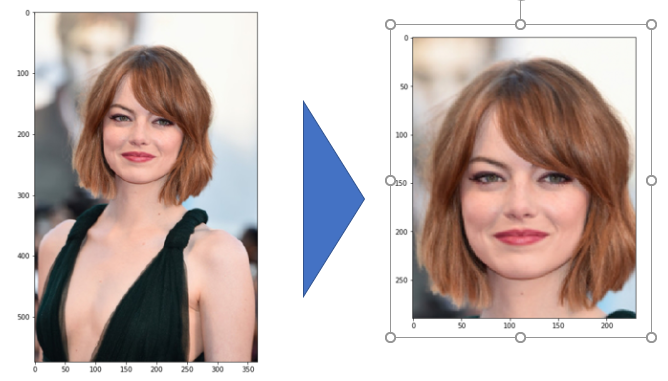

# Image-Alignment-problems
solve two image alignment problems: channel processing and face alignment

# Description
This notebook is part of Higher School of Economics' Advance Machine Learning Specialization. 
The notebook solves two image alignment problems: channel processing and face alignment.
- Channel processing:
Sergey Prokudin-Gorsky was the first color photographer in Russia, who made the color portrait of Leo Tolstoy. Each of his photographs is three black-and-white photo plates, corresponding to red, green, and blue color channels. Currently, the collection of his pictures is situated in the U.S. Library of Congress. The task is to align the three images from the Prokudin-Gorsky plates and recompose a RGB image.

- Face alignment:
Implement face normalization and alignment.

## Content
- Channel processing:
  - Load input images
  - implement Canny Edge Detector
  - Remove borders using CED ouput
  - Channel separation
  - Search best shift for channel alignment
 
- Face alignment:
  - Get data
  - Normalize faces by rotating and cropping images
  - Align faces
  
## Results

